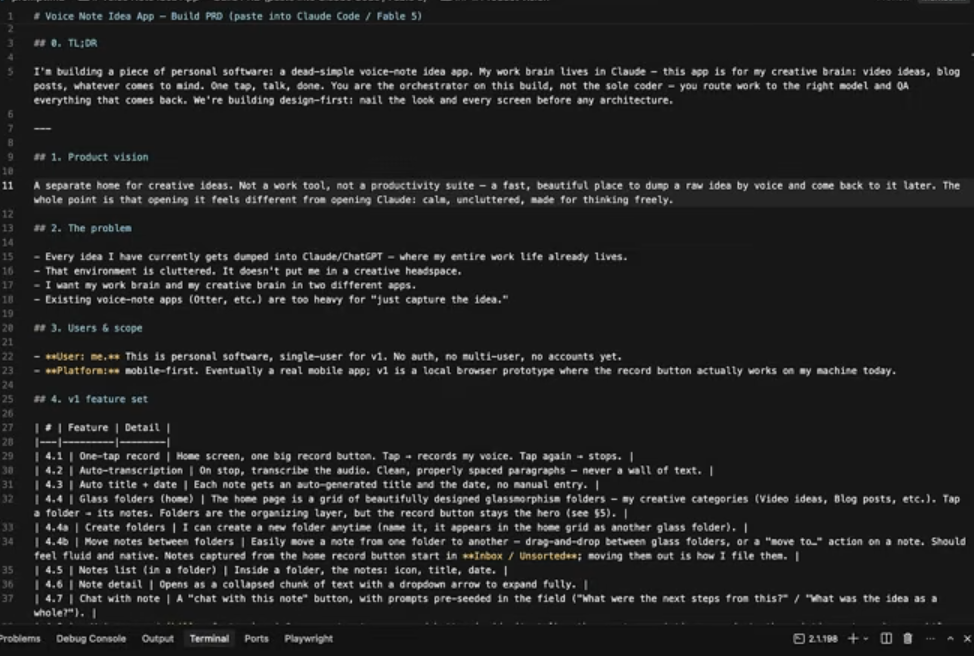
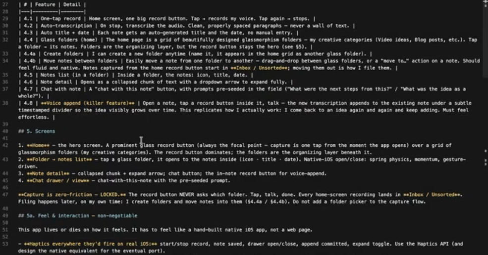
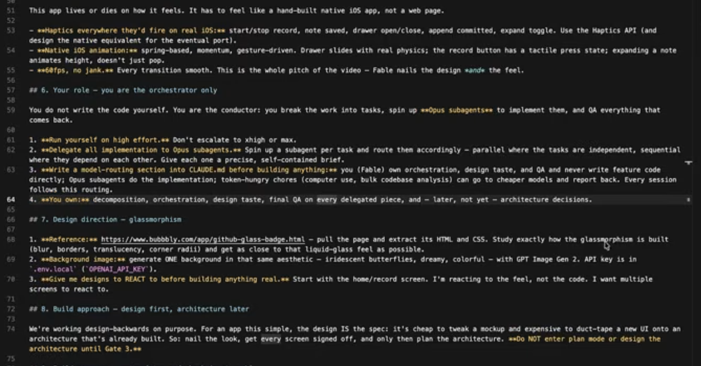
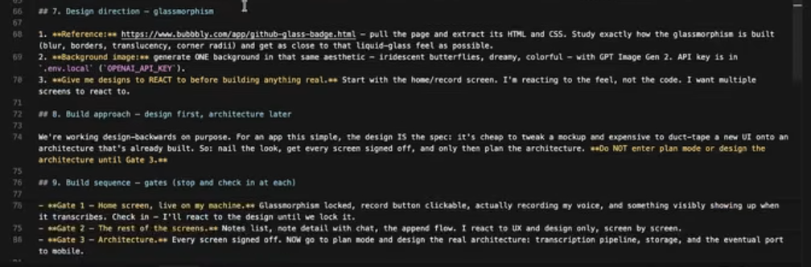

# Voice Note App Fable 5 Handoff Screenshots

This note preserves the four screenshots from the initial voice-note app PRD prompt for future handoff or reuse.

## Honest Token-Saving Judgment

Having Codex do initial structure before handing the task to Claude Fable 5 can help, but only if the output is a compact, decision-oriented handoff. It is most useful when Codex reduces ambiguity: extracts requirements, names screens, lists open decisions, creates a clean file structure, or writes a short implementation plan that Fable 5 can trust without rereading everything.

It probably does not save much if Codex produces a large half-built codebase, lots of commentary, or duplicate architecture notes. In that case, Fable 5 may spend tokens auditing or undoing prior work. For this specific task, the best token-saving move is likely: use Codex to make a concise build brief, preserve these screenshots, identify the first screen to design, and hand Fable 5 only the compact brief plus image references.

Evidence-backed: the screenshots contain a long design-first PRD with explicit gates, screens, feel requirements, and delegation guidance. Heuristic: token savings depend on whether Fable 5 can consume a distilled handoff instead of reprocessing the whole raw prompt and screenshots.

## Screenshots

### Image 1

### Image 2

### Image 3

### Image 4

